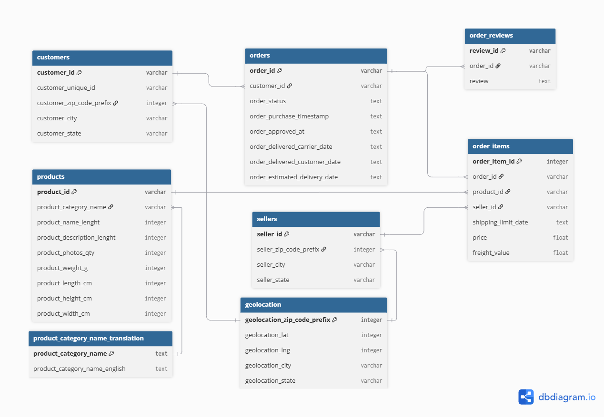
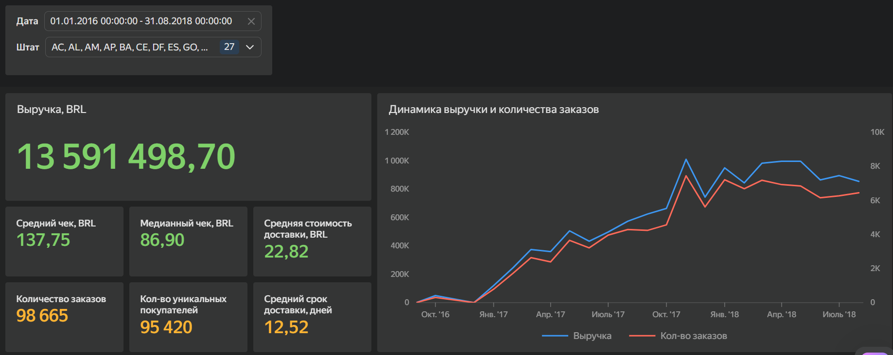

# Построение отчетности: Brazilian E-Commerce (Olist)

## Описание проекта

Проект посвящен построению отчетности и написанию аналитических запросов на основе открытого датасета Brazilian E-Commerce (Olist).

В рамках проекта был реализован полный цикл работы с данными:
- загрузка исходных данных в базу данных sqlite;
- построение витрины данных olist_mart;
- построение отчета в DataLens (https://datalens.yandex/54sbengf1x94o?_share_link=public);
- написание аналитических SQL-запросов.

---

## Используемые технологии

- DataLens
- SQL
- Git

---

## Структура проекта

```
olist-project/
│
├── data/
│   └── input/
│   └── output/
├── images/
│   └── schema.png
├── main.ipynb
└── README.md
```

---

## Модель данных



## Построенная витрина для отчета olist_mart (data/output/olist_mart.csv)

Хранит информацию по каждому заказу пользователя:
- order_id - уникальный айди заказа
- customer_unique_id - уникальный айди клиента
- customer_order_number - порядковый номер заказа клиента
- customer_city - город клиента
- customer_state - штат клиента
- order_purchase_timestamp - дата и время покупки
- order_delivered_customer_date - дата и время доставки
- delivery_days - полное количество дней доставки
- month_date - месяц и год
- year_date - год
- order_total - сумма заказа
- freight_total - сумма доставки
- items_count - количество предметов в заказе

Код сбора витрины можно найти в main.ipynb

---
## Построенный отчет в DataLens

На основе витрины olist_mart был построен обзорный отчет о деятельности компании. Ссылка на отчет - https://datalens.yandex/54sbengf1x94o?_share_link=public.

Отчет имеет помесячную гранулярность и отражает следующие метрики и их динамику:
- выручка
- средний чек
- медианный чек
- средняя стоимость доставки
- средний срок доставки
- количество заказов
- количество уникальных пользователей



---

## Аналитические запросы

В рамках проекта реализованы запросы для анализа:

- топ-10 категорий товаров, принесших самую большую выручку за все время;
- топ-10 клиентов с самой большой суммой заказов и их локацией за все время;
- топ-10 городов, принесших самую большую выручку за все время;
- динамика выручки заказов в Sao Paulo по месяцам
- клиенты, которые не оставляли отзыв на все заказы и количество заказов без отзыва

Все запросы можно найти в main.ipynb